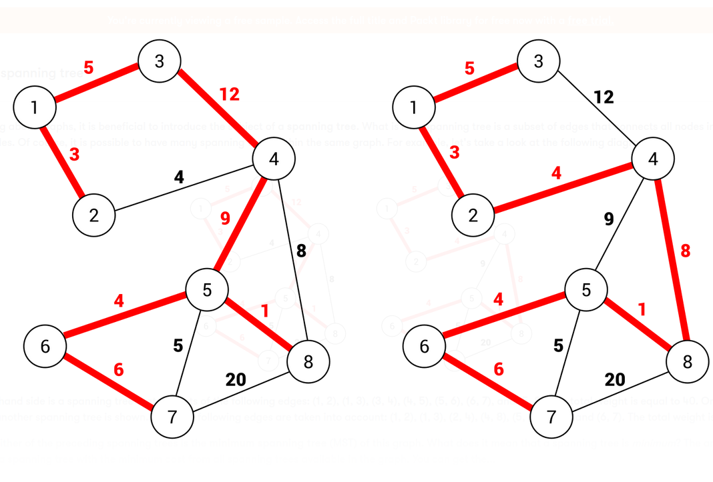
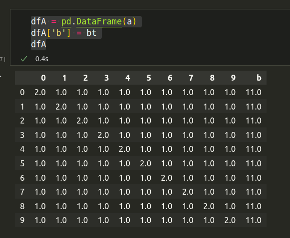

# kirkhoff computation for electric primitives

graph to equivalent to incidence matrix to component equations matrix

yfiles lib layout api: https://docs.yworks.com/yfileshtml/#/dguide/layout_graph_api-structure#layout_graph_customized_data_accessors

как записать метод контурных токов по графу

## эквивалентирование

определение узлов

определение остовного графа

выделелние циклов, 
<!-- // идентификация контурных токов в компонентах -->
составление топологической матрицы

составление матрицы коммутации - модификация топологической матрицы
регуляризация топологической матрицы - P транспонирование, LU разложение, 

seem https://ultimateelectronicsbook.com/steady-state-transient/

Выделение независимых контуров можно осуществить одним из перечисленных выше методов. Следует отметить, что система независимых контуров, как правило, не единственна, как не единственно и максимальное дерево цепи. Однако системы уравнений, составленные по различным системам контуров математически эквивалентны, поэтому возможен специальный подбор системы контуров, дающей наиболее простую систему уравнений.

Отметим также, что при любом выборе системы контуров в любом контуре обязательно найдётся ребро, которое входит только в этот контур и ни в какой другой. Таким образом, контурный ток всегда совпадает с током в одном из рёбер этого контура. Например, для схемы, изображённой на рисунке, звено 4 входит только в левый контур, поэтому контурный ток обозначен как I4. То же самое относится к двум другим контурам, токи в которых обозначены как I5 и I6. В литературе встречаются и другие обозначения для контурных токов, например, римскими цифрами (II, III, IIII ...), латинскими буквами (IA, IB, IC ...) и т. д.

считаем токи для ребер которые удалены из остовного дерева? -- уникальные контурные токи

Это общий подход - получаем  все параметры в одной строке. А потом eval - ом считаем.
Можешь в качестве разминки посчитать произведение двух квадратных матриц

pivot, compose ??????

flatten, multiply, reshape back

- Набор расчетных моделей обращается к графу и индексу
- Считываются данные о топологии графа
- Построение эквивалентной схемы
- группировка независимых объектов для моделирования - кластеризация
- выделяем узлы, ветви …
- Расчет модели во времени
- Для текущей топологии графа расчет значений потоков и потенциалов искомых переменных
- Результаты записываются в индекс
- Расчет агрегирующих функций и запись в индекс
- Результаты считываются и отображаются на графе/в отчетах

var items = [
  [1, 2],
  [3, 4],
  [5, 6]
];

топология
коммутация
временной ряд  * вектор [0, 1, 0, 0]

[I1, I2, I3, I4]

| .... A | append [| ... B]

A * X = B

A * T * [X + loss] = [B + eps]

A - топология
T - коммутация
I - токи неизвестны
Z - значения измерений

S - 

| makeresults 1
| my_np_linalg_solve a=[ | my_to_matrix type=eye size=10] b=[ | fsget fs/linang/E] 
 to X | fields X | fsput fs/res/X

Фидер_1 <<СкрытьСумму>> + <<Канал_02>>.КП_01.Блок_данных_01.Группа_ТИТ_01.ТИТ_01.Значение_новое

