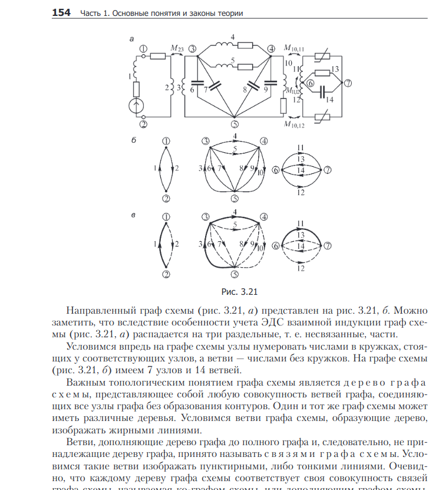

# Метод контурных токов

пример тоэ https://www.toehelp.ru/exampls/toe/1/2/


Метод контурных токов независимых контуров;


    Метод анализа колебаний в электрических цепях, в котором неизвестными, подлежащими определению, являются контурные токи, называется методом контурных токов.

Контурным током называют условный ток, протекающий внутри независимого контура.

Напомним, что контуры называются независимыми, если они отличаются друг от друга хотя бы одним элементом (ветвью). 

Направление отсчёта контурного тока выбирается произвольно и независимо от выбора направлений отсчётов контурных токов в других контурах. В отличие от метода токов ветвей, рассмотренного в лекции 4, данный метод позволяет уменьшить число уравнений, описывающих схему, до величины, равной числу


$$
C Z C^T I_2 = C(E+ZJ)
$$

где

${ \mathbf {C} }$ — матрица контуров размера n × p (где n — количество независимых контуров, р — количество звеньев) , в которой i–я строка соответствует независимому контуру i, а j–й столбец соответствует звену j, причём элемент $C_{ij}$ равен

- 0, если ребро j не входит в контур i;
- 1, если ребро входит в контур, и направление ребра соответствует направлению обхода контура;
- –1, если ребро входит в контур, и направление ребра противоположно направлению обхода контура.

Для каждого ребра задаётся направление, которое обычно ассоциируется с направлением тока в этом ребре;

${ \mathbf {Z}}$ — диагональная матрица сопротивлений размера $p \times p$, в которой диагональный элемент $Z_{ii}$ равен сопротивлению i–го ребра, а недиагональные элементы равны нулю;

${ \mathbf {C} ^{t}}$ — транспонированная матрица контуров;

${ \mathbf {I} _{2}}$ — матрица-столбец контурных токов размером $n \times 1$.

${ \mathbf {J} }$ — матрица-столбец источников тока размером p × 1, где каждый элемент равен току источника в соответствующем ребре, причём эта величина нулевая, если в данном ребре источник тока отсутствует; положительная, если направление тока источника совпадает с направлением тока в ребре; и отрицательная в противном случае;

${ \mathbf {E} }$ — матрица-столбец источников ЭДС размером $p \times 1$, где каждый элемент равен ЭДС источника в соответствующем ребре, причём эта величина нулевая, если в данном ребре источник ЭДС отсутствует; положительная, если направление ЭДС источника совпадает с направлением тока в ребре; и отрицательная в противном случае. 

## graph, tree





схема (а) и граф схемы (б)


$$
\begin{align}
n_k = n_v - n_u + 1
\end{align}
$$


Предварительно покажем, что при известных контурных токах можно найти токи всех ветвей, а потому и напряжения на всех элементах цепи. 

Действительно, ток в любом элементе (ветви) определяется по первому закону Кирхгофа (ЗТК) как алгебраическая сумма контурных токов, протекающих в этом элементе. 

<!-- Например, при выбранных в удлинителе (рис. 5.3) направлениях отсчётов токов элементов и контурных токов имеем: -->


Зная токи, протекающие в элементах, можно по закону Ома определить напряжения на каждом из них.


## Составление контурных уравнений

При составлении системы контурных уравнений воспользуемся вторым законом Кирхгофа и будем полагать, что (рис. 5.4):

- цепь согласно (5.4) содержит $n_k = n_v - n_u + 1$
- в цепи имеются источники напряжения с ЭДС $e_k, k = 1..n_k$
- все $n_k$ независимых контуров непосредственно связаны друг с другом, т. е. для $i$-го и $j$-го контуров имеется хотя бы один элемент $R_ij$ который входит в оба эти контура, причём $R_ij = R_ji$


При этих условиях, выбранных независимых контурах и заданных направлениях отсчётов контурных токов запишем уравнение для первого контура (см. рис. 5.4) согласно второму закону Кирхгофа:

Выразим напряжения на элементах 1-го контура через токи ветвей по закону Ома:


$$
\begin{align}
k&: u_{kl} = i_{kl} \cdot R_{kl} \\
k&: -\sum{e_k} + \sum_i {I_{ki} R_{ki}} = 0
\end{align}
$$

выразим токи ветвей через контурные токи
<!-- , нумерация которых осуществляется римскими цифрами и прямыми латинскими буквами.  -->

$$
\begin{align}
I_k: [i_{k1}, i_{k2}, i_{k3}, i_{k4}, ...] \cdot I \\
R_l: [0, 1, 0, 0] \cdot I
\end{align}
$$

Где $I_k$ - токи контуров, $R_l$ - индикация для элементов - ветвей. 

Для каждого элемента рассчитываются токи - составляем список контуров в которых элемент состоит.

### эквивалентирование графа

добавить общий нулевой узел

```js
// let eq= graph.accessor(graph)
let eqGraph = graph.clone();

let gnd = new ygraph.INode();
eqGraph.add(gnd);

// find all elements that are implied connected to gnd

// filter elements by tag "is_grounded" = true

// graph.nodes.find(node => eval(node.tag.properties).is_grounded === true)

// graph.nodes.map(node => node.tag.primitiveID).find(nodeID => eval(nodeID).is_grounded === true).toArray()

graph.nodes.map(node => node.tag.primitiveID).toArray().map(nodeID => eval(nodeID).is_grounded)


// console.log(graph.nodes.toArray());

let properties = graph.nodes.toArray().map(
node => eval(node.tag.properties));
console.log(properties);

let hasProp = graph.nodes.toArray().map(
node => eval(node.tag.properties).hasOwnProperty(is_grounded));
console.log(hasProp);
// hasOwnProperty

// let is_grounded = graph.nodes.find(
node => eval(node.tag.properties).is_grounded === True);
console.log(is_grounded);

' '


graph.predecessors(
    graph.nodes.find(
    node => node.tag.primitiveID === primitiveID)).map(
    node => node.tag.primitiveID).toArray().map(nodeID => eval(nodeID).testField)

let nodes = graph.nodes.map(
    node => node.tag.primitiveID).toArray().map(nodeID => eval(nodeID));

console.log("nodes", nodes);


let portOwner = graph.ports.find(port => port.tag.primitiveID === primitiveID).owner;
console.log(primitiveID);
let inEdges = graph.inEdgesAt(portOwner).filter(edge => edge.targetPort.tag.primitiveID === primitiveID).toArray()
let outEdges = graph.outEdgesAt(portOwner).filter(edge => edge.sourcePort.tag.primitiveID === primitiveID).toArray()
console.log(inEdges, outEdges);
if (inEdges.length < 1) {
    if (outEdges.length < 1) ' '
    else {
        eval(outEdges[0].targetPort.tag.primitiveID).status
    }
}
else {
    eval(inEdges[0].sourcePort.tag.primitiveID).status
}


```


### выделение контуров

построение контурных уравнений по графу

- минимальное остовное дерево по приоритетам [E,C,R,L,I]


subgraph - minimal complete (fully defined part of system)
our oneline diagram bounded with sensors == subgraph


1. set weigth to each node: [E = 0,C = 1,R = 10,L = 100,I = 1000]
    - custom graph_data_accessors https://docs.yworks.com/yfileshtml/#/dguide/layout_graph_api-structure#layout_graph_data_accessors
1. compute spanning tree for subgraph
    - q: what if there no sensor data: join subgraphs in large-scale model

1. spanning tree + outher graph nodes >> contour eqs
    - compute contour eq by static graph
    - cycle iteration procedure: identify element direction wrt to contour current
    - potential model: save cycle eqation to compoment (comp current == sum of contour currents)
    - current model: save cycle equation as is == comp current are evaluated later from model solution >> less matrix size
1. contour eqs >> incidence matrix

поскольку возможны разные методы составления системы уравнений для одной и той же задачи

* метод контурных токов - только для линейно независимых переменных
* метод узловых потенциалов - решаем для всех переменных
* расширенный метод - см. 


spanning tree on eq graph

singleline graph:
- nodes: comp
- edges: links

singleline graph:
- nodes: nodes, connectivity nodes
- edges: components
    - weight for span tree: enum[ERCLI]->int
    - weight eq: potential IR 


### составляем список контуров для элемента

- выделить циклы
- посчитать матрицу - в каких циклах состоит элемент
- значения - [-1, 0, 1] - в зависимости от принадлежности и направления тока элемента соответственно току контура

```js
f_is_aligned(node, cicle_iterator) {
    edge = cicle_iterator.next();
    targetPort = edge.target.tag.primitiveId;
    // targetNode = portOwner()
    if (targetPort.is_input())
        return 1;
    else 
        return -1;
}
```


// console.log(graph.nodes.toArray());

let properties = graph.nodes.toArray().map(
node => eval(node.tag.properties));
console.log(properties);


console.log(properties[2].hasOwnProperty("is_grounded")); // true


let properties = graph.nodes.toArray().map(
node => eval(node.tag.properties));
console.log(properties);

// console.log(properties[2].hasOwnProperty("is_grounded")); // true


const items = graph.nodes.filter(node => eval(node.tag.properties).hasOwnProperty("is_grounded") === True);

console.log(items);

' '